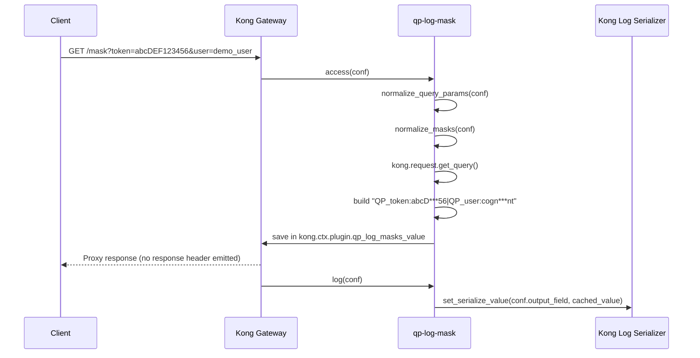

# QP Log Mask Plugin: End-to-End Code Walkthrough

## Objective
Explain how `qp-log-mask` transforms incoming query parameters into a masked log field, from plugin load to log emission.

## Files That Matter
- `kong/plugins/qp-log-mask/init.lua`: plugin entrypoint
- `kong/plugins/qp-log-mask/schema.lua`: config contract and validation
- `kong/plugins/qp-log-mask/handler.lua`: runtime behavior (`access` + `log`)
- `spec/qp-log-mask/*.lua`: expected behavior and edge-case coverage

## High-Level Flow

```mermaid
flowchart LR
    A[Incoming HTTP request] --> B[access phase]
    B --> C[Read query args]
    C --> D[Pick configured keys]
    D --> E[Apply ordered mask rules]
    E --> F[Build QP_key:value entries]
    F --> G[Store final string in kong.ctx.plugin.qp_log_masks_value]
    G --> H[log phase]
    H --> I[kong.log.set_serialize_value(output_field, value)]
    I --> J[Downstream logging plugins/sinks]
```

## Runtime Sequence (Per Request)



## Core Functionality: Line-by-Line Walkthrough (`handler.lua`)

This section focuses only on the runtime-critical lines that implement the end-to-end behavior.

| `handler.lua` lines | Core logic | Why it matters |
|---|---|---|
| 1-5 | Plugin metadata (`PRIORITY`, `VERSION`) | Priority controls execution order so masked value is ready before downstream log consumers. |
| 18-30 | `split_csv(s)` | Supports legacy `query_params: "a,b,c"` by converting it into an array. |
| 32-43 | `normalize_value(value)` | Drops `nil`/empty values early so empty query params do not pollute logs. |
| 45-66 | `normalize_masks(conf)` | Chooses new mask format first; converts legacy `{ regex, replace }` into `{ pattern, mask }`. |
| 68-80 | `normalize_query_params(conf)` | Chooses new key list first; falls back to legacy CSV list when needed. |
| 82-86 | `apply_masks`: input guard | Stops processing when value is empty after normalization. |
| 88-102 | `apply_masks`: ordered masking loop | Applies each rule in order so later rules can transform prior output. |
| 90-95 | Pattern/replacement resolution | Supports both modern (`pattern`,`mask`) and legacy (`regex`,`replace`) keys. |
| 97-100 | `pcall(ngx.re.gsub, ..., "jo")` | Prevents request failure on bad regex; plugin degrades safely instead of crashing. |
| 107-117 | `collect_values` table path | Handles repeated query params (`?token=a&token=b`) and masks each value. |
| 119-124 | `collect_values` scalar path | Handles normal single-value params and returns consistent list shape. |
| 127-135 | `access(conf)` disable guard | Full no-op when `enabled=false`. |
| 137-141 | `access(conf)` key-list guard | No configured keys means skip processing immediately. |
| 143-147 | Load masks + query args guard | Reads request query map and exits safely if shape is unexpected. |
| 151-157 | Per-key aggregation loop | For each configured key, collects masked values and builds `QP_<key>:<values>`. |
| 155 | Entry format construction | Enforces stable token format expected by consumers (`QP_key:v1,v2`). |
| 159-161 | Empty result guard | Prevents writing empty output when no useful values exist. |
| 163-165 | Final payload + context cache | Joins key tokens with separator and stores value in `kong.ctx.plugin.qp_log_masks_value`. |
| 168-176 | `log(conf)` disable guard | Ensures disabled plugin never mutates serializer output. |
| 178-182 | Serializer write | Emits cached value with `kong.log.set_serialize_value(conf.output_field, value)`. |

## Core Path Pseudocode

```text
access(conf):
  if disabled -> return
  keys = normalize_query_params(conf)
  if keys empty -> return
  masks = normalize_masks(conf)
  args = kong.request.get_query()
  if args invalid -> return
  out = []
  for key in keys:
    values = collect_values(args[key], masks)
    if values not empty:
      out.push("QP_" + key + ":" + join(values, ","))
  if out empty -> return
  kong.ctx.plugin.qp_log_masks_value = join(out, conf.separator or "|")

log(conf):
  if disabled -> return
  if ctx value exists:
    kong.log.set_serialize_value(conf.output_field, ctx value)
```

## Concrete Example

Input request:
```http
GET /mask?token=abcDEF123456&user=demo_user
```

Config:
```yaml
query_params_to_log: [token, user]
query_params_log_mask:
  - pattern: "(.{4}).+(.{2})"
    mask: "$1***$2"
separator: "|"
output_field: "qp_log"
```

Transformation:
1. `token=abcDEF123456` -> `abcD***56`
2. `user=demo_user` -> `cogn***nt`
3. Build entries:
   - `QP_token:abcD***56`
   - `QP_user:cogn***nt`
4. Join:
   - `QP_token:abcD***56|QP_user:cogn***nt`
5. Emit to serializer field `qp_log`.

## Config Contract (`schema.lua`)

Modern runtime fields:
- `enabled` (bool, default `true`)
- `query_params_to_log` (array of strings)
- `query_params_log_mask` (array of `{ pattern, mask? }`)
- `separator` (string, default `|`)
- `output_field` (string, default `qp_log`)

Backward-compatible fields:
- `query_params` (legacy CSV list)
- `masks` (legacy `{ regex, replace }`)
- `add_response_header`, `response_header_name` are retained for compatibility but runtime no longer emits response headers.

## Behavior Matrix (Easy Reference)

| Scenario | Result |
|---|---|
| `enabled=false` | No processing in both phases |
| key missing in query | key is skipped |
| key present but empty value | value is skipped |
| repeated key | masked values joined with `,` inside same key token |
| invalid regex pattern | safely ignored (request continues) |
| no collected entries | no serializer field written |
| legacy config used | normalized and processed like modern config |
| `add_response_header=true` | still no response header emitted |

## What Tests Confirm

- Schema validation:
  - accepts defaults and optional `mask`
  - rejects invalid types/missing required pattern
  - accepts legacy fields
- Unit behavior:
  - access+log happy path
  - disabled no-op
  - legacy compatibility
  - invalid regex and empty values handled safely
- Integration behavior:
  - response headers are never emitted
  - plugin no-op when disabled or config yields no values
  - multiple route configs remain stable

## Mental Model
Treat this plugin as a two-phase pipeline:
1. `access`: compute a safe, compact, deterministic query-param summary.
2. `log`: publish that summary into a structured log field for downstream log processors.
